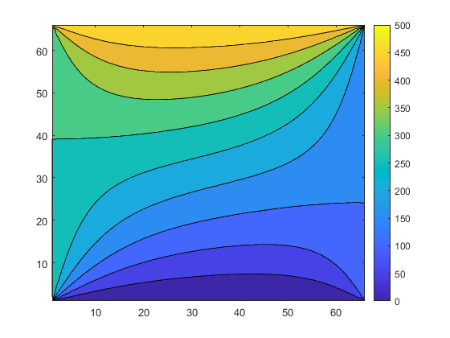

## Cwiczenie 4
### Wykorzystanie środowiska MATLAB do analizy numerycznych zagadnień inżynierskich.

Napisać program obliczający metodą iteracji Gaussa-Seidla rozkład potencjałów na powierzchni obszaru przedstawionego na rys.1.Podzielić badany obszar na jednakowe elementy, które utworzą w środku: 4, 9, 16 i 25 węzłów. Dla każdego z przypadków przedstawić w postaci wykresu rozkład potencjału na badanej powierzchni.

